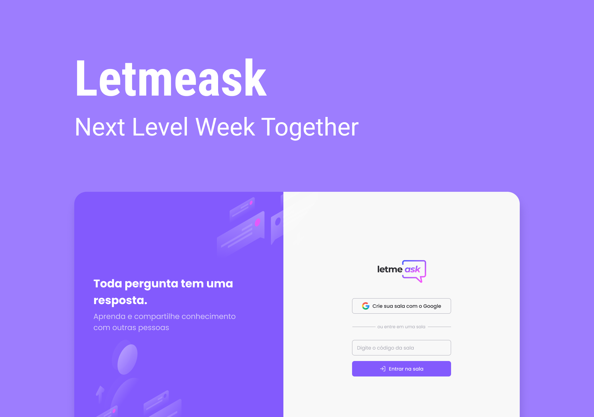

<h3 align="center">
    
    <br>
</h3>

<p align="center"> Aplicação desenvolvida durante a Next Level Week 6.0 da Rocketseat. </p>

## 🔎 O que é o Letmeask?

O Letmeask é uma plataforma para facilitar o fluxo de dúvidas durante lives, por meio dela os telespectadores podem deixar suas perguntas, votar nas mais interessantes e acompanhar quais estão sendo respondidas durante a live.

## 💻 Tecnologias Utilizadas

O projeto foi desenvolvido utilizando as seguintes tecnologias

- TypeScript
- ReactJS
- Firebase Authentication
- Firebase Realtime Database

## 📜 Manual de utilização

### 1. Clonar o projeto em seu computador.


### 2. Instalação 
Para instalar as dependências e iniciar o front:

```bash
cd letmeask
yarn install
yarn start
```

O projeto ficará acessível em ```http://localhost:3000```

<h4 align="center">
    Desenvolvido por <a href="https://www.linkedin.com/in/gabriele-jandres-cavalcanti-249107175/" target="_blank"> Gabriele Jandres 💜</a>
</h4>

